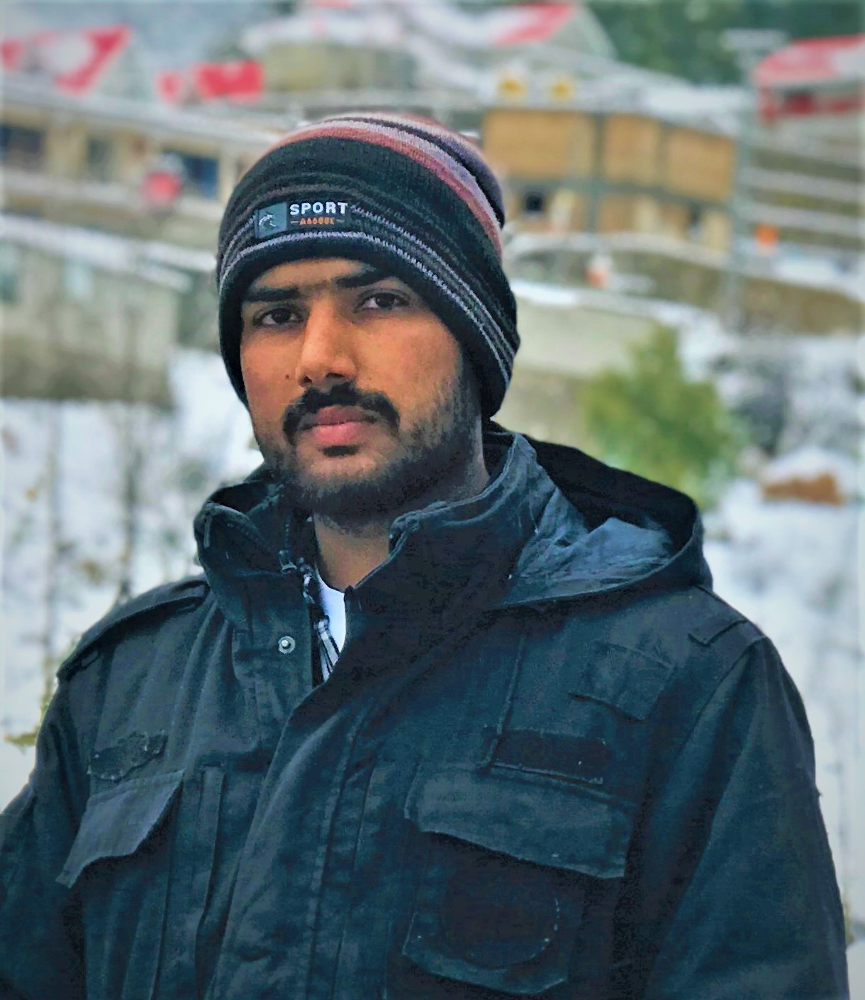
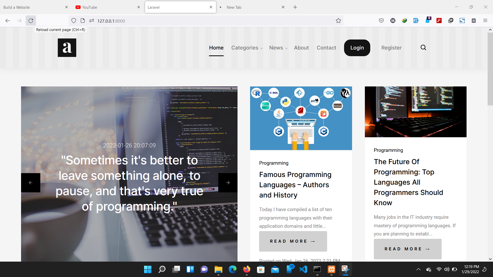
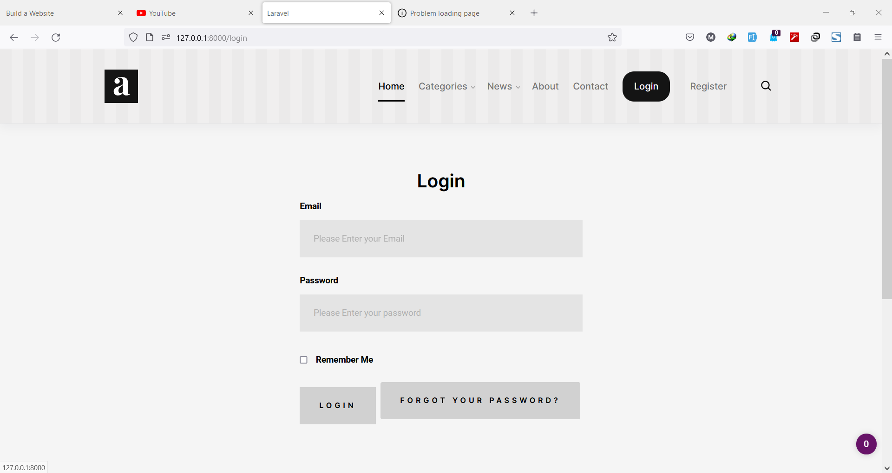
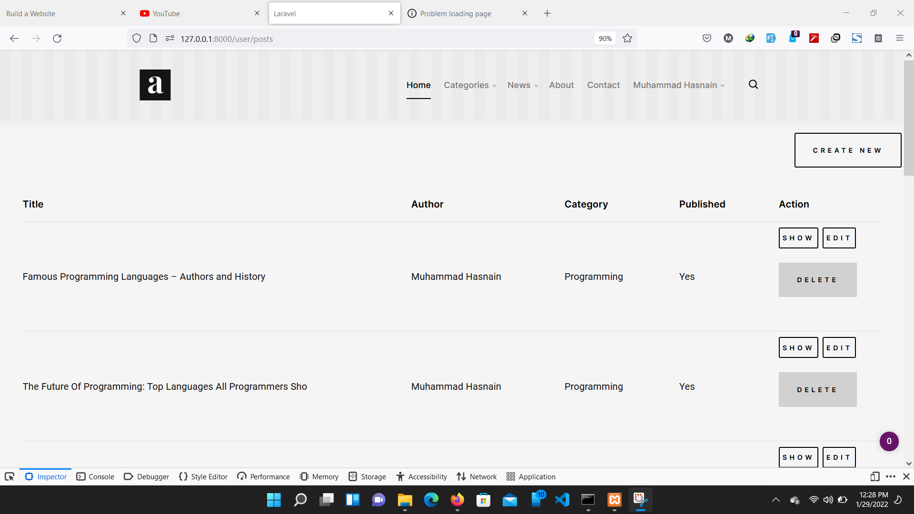

<h3 >
This complete laravel blog app has been developed by <b>Muhammad Hasnain<b> From pakistan.
    </h3>
## types of the users  

- Admin
- User


    ## Admin
        - Admin can read update delete and draft all post 
        - Read contact us messages
        - Change front screen slider image 
        - View All users
        - view all comments
    ## user
        - Admin can read update delete and draft only his post 
        - View his profile
        - view all comments of his posts
    
## Developer Image

<br>
### Contact Information
<a href="mailto:mhasnainjafriprofessional@gmail.com" target="_blank">mhasnainjafriprofessional@gmail.com</a><br>
<a href="mailto:mhasnainjafri0099@outlook.com" target="_blank">mhasnainjafri0099@outlook.com</a><br>
 Whatsapp no : <a href="https://wa.me/+923446800893?text=Hello Hasnain, " target="_blank">+923446800893</a><br>


## Setting up your development environment on your local machine :
```bash
$ git clone https://github.com/MuhammadhasnainJafri/Lara-Blog.git
$ cd LARA-BLOG
$ cp .env.example .env
$ composer install

```
now goto database and create a new database name <b>CodeIT-Blog</b> with no password or else you can set password in .env file for database
now Run Command
```bash
$ php artisan migrate 
$ php artisan db:seed
$ php artisan serve
```
Now you can access the application via [http://localhost:8000](http://localhost:8000).

here are some images of the website that i have created  
This will create a new user that you can use to sign in :
```yml
email: admin@admin.com
password: admin123
```

## Home Page



## login page



## All post page   



## License

laravel-bjyblog is open-sourced software licensed under the MIT license.
 Front-End template Credit (Theme template is taken from StyleShout)
		[https://www.styleshout.com/free-templates/abstract/](https://www.styleshout.com/free-templates/abstract/)

